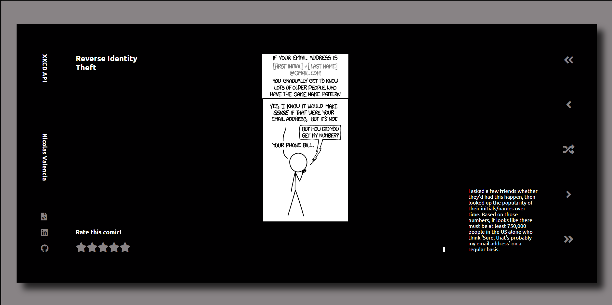
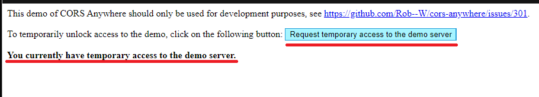
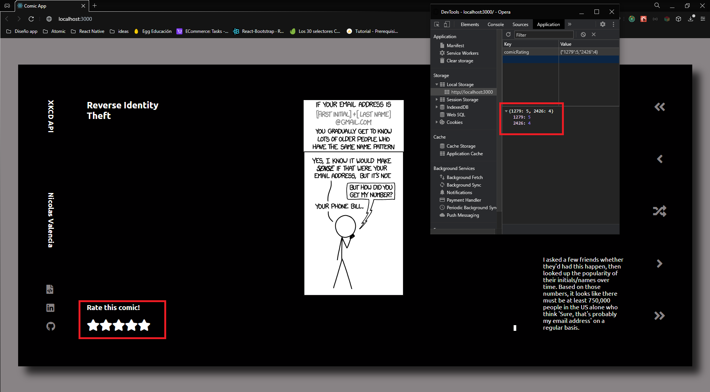

<h1>COMIC APP MASIVIAN</h1>

    </img>

<h1>Como Correr el proyecto</h1>
<ul>
<li>Ingresar al siguiente Link <a href="https://cors-anywhere.herokuapp.com/corsdemo" rel="nofollow">Autorizar CORS</a>

    </img>

<h3>NOTA: Si no se autoriza el demo de CORS la aplicacion no correra completamente</h3>
<li>Posicionate en la carpeta donde clonaste el repositorio y ejecuta npm install</li>
<li>En una terminal  Posicionate en la carpeta que clonaste y ejecuta npm start</li>
</ul>

<h1>RESUMEN</h1>

    Estas fueron todas las configuraciones que debes hacer para correr el proyecto. Ahora vas a poder ver comic's.

    Puedes dar una calificacion a un comic en espesifico, dicha calificacion se guardara en el local storage en un objeto con el numero de comic como propiedad y el valor segun la calificacion que se le de, donde 1 estrella es una calificacion de 1 punto y 5 estrellas es una calificacion de 5 puntos. 

    </img>

    La aplicacion cuanta con un nav lateral con el cual se puede ir al primer, anterior, random, siguiente y ultimo comic de la API.

    Puedes dar click en el siguiente enlace <a href="https://vimeo.com/513647595" rel="nofollow">Video</a> para poder ver un video de la Aplicacion

    <h1> TECNOLOGIAS USADAS </h1>
        <h2>FRONTEND</h2>
        <ul>
            <li>Java Script</li>
            <li>React </li>
            <li>React hooks</li>
            <li>Redux</li>
            <li>Redux hooks</li>
            <li>SASS</li>
        </ul>

